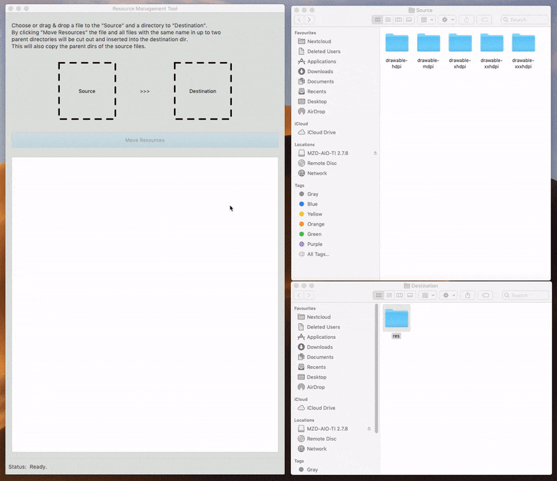

# Welcome to the Skyscaper Resource Management Tool UI.

This is a UI made with Java FX for the Skyscaper Resource Management Tool.

It uses the *skyscaper* library for moving resource files to another directory asynchronously.

---

## Build

The application is meant for building with IntelliJ. Simply hit *build artifact*. This should generate a standalone, working jar-File.

## Usage

So far the tool only offers 3 inputs:

- A) Drag&Drop of source file and destination dir or click on the labels to open file and directory choosers
- B) The *move resources* button which becomes available, if two paths were dropped in A)
- C) Optionally, the file name (plus extension) can be changed via checking and entering a file name to overwrite

All program logs are written to the lower part of the UI.

Example:

